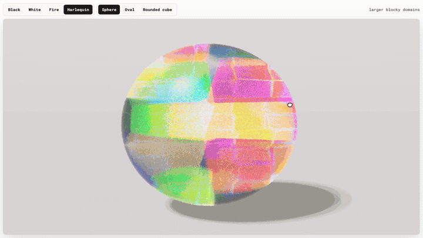

# Opal Path Tracer

## Live Demo

Try the interactive WebGL demo here: **[nano-optics-opal-pathtracer.pages.dev](https://nano-optics-opal-pathtracer.pages.dev/)**



This is a small renderer for exploring opal play-of-color. It treats the stone as a volume of many tiny crystal domains, then traces wavelength-sampled rays through that structure so the color comes from optical geometry rather than a painted texture.

The fast renderer is now the flagship interactive version. It trades some of the older reference renderer's heavier controls for a more immediate studio scene, named opal presets, shape presets, and a sample budget that feels usable inside an article or demo page.

The project is inspired by Soma Yokota and Issei Fujishiro's work on opal rendering. Their useful abstraction is that a visible gem is too large to model sphere by sphere, but it can be represented as a polycrystalline material where each grain has its own local lattice orientation. This repo turns that idea into a compact WebGL experiment that can export turntable frames for AR.

## Article

The companion article is here: [Structural Color in Opals: From Silica Spheres to Photonic Crystals](https://armandsumo.com/posts/opals/).

## Run

```bash
npm install
npm run dev
```

Open the Vite URL and use:

- `fast-pathtracer.html` for the flagship live renderer.
- `pathtracer.html` for the deeper spectral reference renderer and turntable export.
- `scroll.html` for a lightweight atlas viewer.
- `index.html` for the project landing page.

## Export Frames

There are two render paths:

- The native renderer is the production batch path. It runs a Taichi GPU kernel directly on Metal, CUDA, Vulkan, or CPU and writes finished atlases without launching a browser.
- The browser renderer is the reference path. It reuses the live WebGL page, which is useful when the web implementation is the thing being tested, but it is heavier for cloud rendering because Chromium has to start and the volume bake has to happen inside that page.

For quick local checks or cloud atlas generation, start with the native renderer:

```bash
python3 scripts/native_opal_renderer.py \
  --arch auto \
  --presets black,white,crystal,fire,harlequin \
  --angles 144 \
  --cols 12 \
  --frame-size 320 \
  --samples 1 \
  --ray-steps 3 \
  --output-dir renders/native-preset-atlases
```

On Modal, use the native entrypoint so the GPU worker renders directly instead of driving a browser:

```bash
modal run modal_native_render.py \
  --samples 1 \
  --angles 144 \
  --frame-size 320 \
  --cols 12 \
  --ray-steps 3 \
  --presets black,white,crystal,fire,harlequin \
  --output-dir renders/native-preset-atlases
```

On a Modal T4, the command above renders each 144-frame 320px atlas in roughly 17 to 19 seconds of kernel time. That is the path to use for Lens Studio atlas assets.

For a simple native multiview rig, render yaw rows at several elevations:

```bash
modal run modal_native_render.py \
  --samples 1 \
  --view-mode multiview \
  --yaw-angles 36 \
  --pitch-rows 5 \
  --pitch-min -45 \
  --pitch-max 45 \
  --frame-size 320 \
  --cols 12 \
  --ray-steps 3 \
  --presets black \
  --output-dir renders/native-multiview-black-36x5
```

The browser page can export an atlas directly. That path is usually best on a local machine with a real GPU, because the opal volume is baked once and then reused for every camera stop:

```bash
node scripts/render-turntable.mjs 100 \
  --output renders/opal-black-turntable-12x6-512-100spp.webp \
  --preset black --preset-defaults
```

For the Lens Studio turntable atlases, render each named preset the same way:

```bash
OPAL_ANGLES=144 OPAL_FRAME_SIZE=320 OPAL_COLS=12 \
OPAL_OUTPUT_DIR=renders/preset-turntable-atlases-12spp-144x320 \
./scripts/render-preset-turntables.sh 12
```

The old browser-on-Modal path is still useful when you need exact parity with `pathtracer.html`, but be aware of the tradeoff: a one-frame-per-worker job starts a fresh browser and bakes the opal volume for every angle. The batch renderer reduces that waste by letting each worker bake once and capture a small run of views:

```bash
modal run modal_render.py \
  --samples 32 \
  --angles 144 \
  --frame-size 320 \
  --presets black,white,crystal,fire \
  --output-dir renders/preset-turntable-frames-32spp-144x320 \
  --batch-size 4 \
  --concurrency 12
```

For the browser path, a simple multiview rig renders yaw rows at several elevations. This does not synthesize novel views, it only captures a denser camera set around the same baked opal:

```bash
modal run modal_render.py \
  --samples 16 \
  --view-mode multiview \
  --yaw-angles 36 \
  --pitch-rows 5 \
  --pitch-min -45 \
  --pitch-max 45 \
  --frame-size 320 \
  --presets black \
  --output-dir renders/multiview-black-36x5-16spp \
  --batch-size 6 \
  --concurrency 8
```

The current README preview was clipped from `Opal-Fast-PathTracer.mp4`:

```bash
ffmpeg -ss 00:00:17.4 -t 4.5 -i Opal-Fast-PathTracer.mp4 \
  -vf "fps=12,scale=720:-1:flags=lanczos,split[s0][s1];[s0]palettegen=max_colors=128[p];[s1][p]paletteuse=dither=bayer:bayer_scale=3" \
  media/opal-fast-pathtracer-preview.gif
```

## What It Does

- Builds a compact internal grain field for the opal body.
- Gives each grain a local lattice orientation.
- Samples wavelengths during path tracing instead of choosing RGB colors up front.
- Uses the grain orientation and ray direction to produce Bragg-like flashes.
- Accumulates spectral samples and converts the result to display color at the end.
- Exports turntable imagery that can be used as an AR texture sequence.

## Current Features

- Live WebGL renderer with controls for sphere diameter, body tone, domain scale, percolation, scattering, and sample count.
- Fast WebGL renderer for article embeds and live demos, with studio lighting, named presets, shape presets, orbit controls, and progressive accumulation.
- Original spectral reference renderer with deeper tuning controls and turntable export.
- Worker-based volume bake so changes do not freeze the UI.
- Named starting presets for black, white, crystal, fire-like, and harlequin-like opal looks.
- Native Taichi atlas renderer for fast preset turntables and multiview sheets.
- AR-readable native preset tuning: lower `domain_scale` values create larger domains, larger sphere diameters bring red wavelengths back into the palette, and harlequin uses a low-jitter anisotropic Voronoi field for rectangular plate-like domains.
- Turntable atlas export from the browser.
- Scripted single-frame, frame-batch, atlas, and multiview rendering through Puppeteer.
- Optional Modal renderer for parallel frame or frame-batch jobs.
- Lightweight scroll viewer for exported atlases.

## Still Rough

- Opal type presets are still artistic starting points. Black opal, white opal, crystal opal, fire opal, and harlequin now have native defaults tuned for readable AR atlases, but common opal, pinfire, broadflash, and rolling-flash presets still need calibrated notes about body tone, sphere diameter range, domain scale, and viewing behavior.
- Percolation needs a more physical control. The current slider changes connectivity, but it should eventually map to target domain size and cluster statistics.
- Neighboring grain orientations are too independent, which can make rotation feel jumpier than real opal footage.
- Cabochons, thin slabs, and cutaways need better path length handling than the current sphere-first turntable path.
- Lighting is intentionally simple and still needs richer reference presets for documentation renders.

## Files

| File | Role |
| --- | --- |
| `fast-pathtracer.html` | Flagship interactive renderer for live demos and article embeds |
| `pathtracer.html` | Spectral reference renderer, detailed UI, and turntable export |
| `scroll.html` | Runtime-friendly atlas viewer |
| `src/opal-volume-baker.js` | Grain-field bake and orientation codebook |
| `src/opal-volume-worker.js` | Worker wrapper for rebakes |
| `scripts/native_opal_renderer.py` | Native Taichi atlas renderer |
| `scripts/render-turntable.mjs` | Puppeteer export script |
| `modal_native_render.py` | Modal GPU wrapper for the native renderer |
| `modal_render.py` | Optional Modal frame renderer |

## References

- Soma Yokota and Issei Fujishiro, "Visual simulation of opal using bond percolation through the weighted Voronoi diagram and the Ewald construction," *The Visual Computer* 40, 5005-5016, 2024. <https://doi.org/10.1007/s00371-024-03504-1>
- Soma Yokota, "Visual Simulation of Opal Using Voronoi Tessellation and Ewald Construction," PhD dissertation, Keio University, 2025.

## Citation

If you cite or reuse this renderer, please use the repository citation file or this BibTeX entry:

```bibtex
@software{sumo_opal_path_tracer_2026,
  author = {Sumo, Armand},
  title = {Opal Path Tracer},
  year = {2026},
  url = {https://github.com/a-sumo/opal-pathtracer},
  license = {MIT}
}
```

## License

MIT
